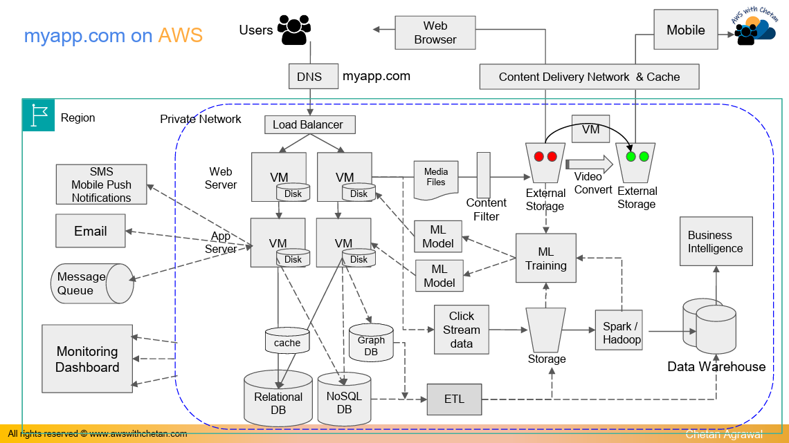
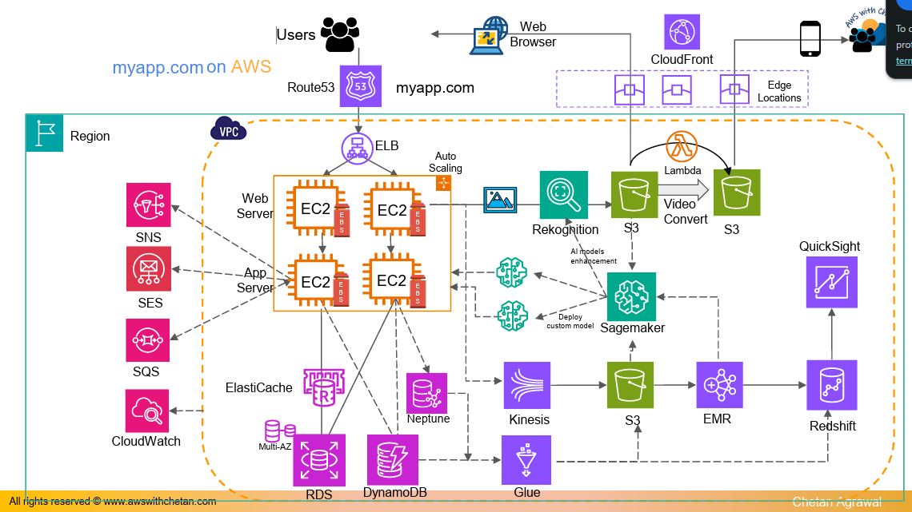

# 1 - AWS Cloud Overview - A Big Picture

## 1.1 - Cloud Computing and AWS Global Infrastructure

**Cloud computing** is the **on-demand delivery of IT resources over the internet with pay-as-you-go pricing**. Resources such as compute, memory, and storage can be increased or reduced depending on demand, so customers pay based on what they use.

A useful analogy is electricity:
- Electricity is consumed when needed and billed based on usage.
- Cloud computing provides computing resources in a similar **on-demand** model.
- Applications and users access resources hosted in a cloud provider's data centers over the internet

### AWS Regions and Availability Zones

An **AWS Region** is a geographic area from which AWS services can be consumed.

Each Region is made up of multiple **Availability Zones (AZs)**, which support **high availability** for applications.

**Exam association:**
- **Geographic area containing AWS infrastructure - AWS Region**
- **Separate locations within a Region used for high availability - Availability Zones**

## 1.2 - Core Application Architecture Concepts

A production application usually contains multiple components rather than a single server.

### Multi-Tier Architecture

The example social media application separates functionality into:
- **Web tier** - handles incoming user requests and caching
- **Application tier** - performs business logic and communicates with databases
- **Data tier** - stores application data

As demand increases, additional web and application servers can be added. This is **horizontal scaling**.

### Load Balancing and DNS

When multiple web servers exist, a **load balancer** provides a common entry point and distributes incoming traffic between them.

A **DNS service** translates a domain name such as `myapp.com` into the address needed to reach the application.

### Storage Types

The architecture distinguishes between:
- **Block storage** - disks attached to virtual machines
- **Database storage** - structured application information
- **Object storage** - media such as images and videos that can be accessed independently over the network

The lecture uses object storage for uploaded media rather than storing large media files directly in the application database.

### Content Delivery Network

A **Content Delivery Network (CDN)** caches content closer to users.

This:
- Reduces latency.
- Avoids repeatedly retrieving the same content from the original storage
- Reduces load on the application's origin resources.

## 1.3 - Core AWS Serving Mapping

| **Application Requirement**  | **AWS Service**                  | **Main Purpose**                                         |
| ---------------------------- | -------------------------------- | -------------------------------------------------------- |
| Private network              | **Amazon VPC**                   | Provides an isolated network for AWS resources           |
| Virtual servers              | **Amazon EC2**                   | Runs virtual machines for web and application servers    |
| EC2 disk storage             | **Amazon EBS**                   | Provides block storage for EC2 instances                 |
| Relational database          | **Amazon RDS**                   | Managed relational database service                      |
| NoSQL database               | **Amazon DynamoDB**              | NoSQL database service                                   |
| Distribute traffic           | **Elastic Load Balancing (ELB)** | Distributes incoming traffic across servers              |
| Automatic horizontal scaling | **Amazon EC2 Auto Scaling**      | Adds or removes EC2 instances according to demand        |
| DNS                          | **Amazon Route 53**              | Maps domain names to application endpoints               |
| Object storage               | **Amazon S3**                    | Stores objects such as images, videos, and other files   |
| Serverless processing        | **AWS Lambda**                   | Runs code in response to events without managing servers |
| Content delivery             | **Amazon CloudFront**            | Caches and servers content through edge locations        |

These services map the traditional application components to managed AWS capabilities.

### Amazon EC2 vs AWS Lambda

#### Amazon EC2
- Provides virtual machines
- Suitable when the application requires continuously running servers
- The server infrastructure must be configured and managed

#### AWS Lambda
- Runs code when triggered by an event
- The example uses Lambda to process a newly uploaded video
- If there is no event, no functions needs to be invoked
- Considered **serverless** because the customer does not manage the underlying infrastructure.

- **Exam clue: virtual server - Amazon EC2**
- **Exam clue: run code without managing servers - AWS Lambda**

### Amazon EBS vs Amazon S3

| **Service**    | **Storage Type** | **Exam Association**                       |
| -------------- | ---------------- | ------------------------------------------ |
| **Amazon EBS** | Block storage    | Disk attached to EC2                       |
| **Amazon S3**  | Object storage   | Images, videos, files, application objects |

- **Need EC2 disk storage - Amazon EBS**
- **Need object storage - Amazon S3**

## 1.4 - Messaging, Notifications, and Monitoring

AWS provides separate services for different communication requirements:

| **Requirement**                   | **AWS Service**       | **Purpose**                                          |
| --------------------------------- | --------------------- | ---------------------------------------------------- |
| Notifications / SMS / mobile push | **Amazon SNS**        | Notification and messaging service                   |
| Email                             | **Amazon SES**        | Email sending service                                |
| Message queue                     | **Amazon SQS**        | Queue-based messaging between application components |
| Monitoring                        | **Amazon CloudWatch** | Monitors AWS resources and application health        |

The lecture maps notification, email, queuing, and monitoring requirements directly to these AWS services.

### SNS vs SES vs SQS

#### Amazon SNS
- Notifications
- SMS and mobile push scenarios

#### Amazon SES
- Email

#### Amazon SQS
- Message queues
- Useful when components need to exchange messages asynchronously

#### Amazon CloudWatch
- Monitoring application and AWS resource health

- **Exam clue: notification service - Amazon SNS**
- **Exam clue: email service - Amazon SES**
- **Exam clue: message queue - Amazon SQS**
- **Exam clue: monitor AWS resources - Amazon CloudWatch**

## 1.5 - Data, Analytics, and Machine Learning

The example application generates large amounts of operational and user data that can be collected, processed, analyzed, and visualized

### Streaming and Analytics Pipeline

A simplified AWS data flow from the lecture is:

**Amazon Kinesis - Amazon S3 - Amazon EMR - Amazon Redshift - Amazon QuickSight**

Supporting services include:

| **Service**                     | **Main Purpose**                                   |
| ------------------------------- | -------------------------------------------------- |
| **Amazon Kinesis Data Streams** | Collects streaming data such as clickstream events |
| **AWS Glue**                    | Extract, transform, and load (**ETL**) data        |
| **Amazon EMR**                  | Runs big-data frameworks such as Hadoop and Spark  |
| **Amazon Redshift**             | Data warehouse for large-scale analytics           |
| **Amazon QuickSight**           | Business intelligence and data visualization       |

The lecture describes ETL as collecting data from multiple sources, transforming it, and preparing it for analytics and a data warehouse.

**Exam associations:**
- **Streaming data - Amazon Kinesis**
- **ETL - AWS Glue**
- **Hadoop / Spark analytics - Amazon EMR**
- **Data warehouse - Amazon Redshift**
- **Business Intelligence dashboards - Amazon QuickSight**

### Machine Learning and AI

#### Amazon SageMaker
- Platform for building and training custom machine learning models
- Models can then be integrated into applications

#### Amazon Rekognition
- Prebuilt AI capability for analyzing images and videos

The distinction is that **SageMaker** is used to build custom ML models, while services such as **Amazon Rekognition** provide ready-to-use AI capabilities.

- **Need to build a custom ML model - Amazon SageMaker**
- **Need image/video analysis using a prebuilt AI service - Amazon Rekognition**

## 1.6 - Infrastructure as Code

Manually creating a large AWS environment can involve many configurations across services.

**Infrastructure as Code (IaC)** allows infrastructure to be defined in code or templates and deployed automatically.

### AWS CloudFormation

**AWS CloudFormation** allows AWS infrastructure to be described in a template and automatically created by AWS.

Benefits highlighted in the lecture:
- Reduces manual infrastructure configuration
- Makes complex deployments easier to automate
- Helps avoid repeatedly creating resources by hand
- Fits into DevOps automation practices

**Exam clue: deploy AWS infrastructure from templates - AWS CloudFormation**

## 1.7 - Exam Focus

- **On-demand IT resources + pay-as-you-go pricing - Cloud computing**
- **Geographic AWS deployment area - AWS Region**
- **High availability locations inside a Region - Availability Zones**
- **Private AWS network - Amazon VPC**
- **Virtual machine - Amazon EC2**
- **Persistent block storage for EC2 - Amazon EBS**
- **Managed relational database - Amazon RDS**
- **NoSQL database - Amazon DynamoDB**
- **Object storage - Amazon S3**
- **DNS - Amazon Route 53**
- **Distribute incoming traffic - Elastic Load Balancing**
- **Automatically add or remove EC2 capacity - Amazon EC2 Auto Scaling**
- **Serverless event-driven code - AWS Lambda**
- **CDN / edge caching - Amazon CloudFront**
- **Streaming data - Amazon Kinesis**
- **ETL - AWS Glue**
- **Big-data processing with Hadoop / Spark - Amazon EMR**
- **Data warehouse - Amazon Redshift**
- **Business intelligence - Amazon QuickSight**
- **Build custom ML models - Amazon SageMaker**
- **Analyze images and video - Amazon Rekognition**
- **Notifications - Amazon SNS**
- **Email - Amazon SES**
- **Message queues - Amazon SQS**
- **Monitoring - Amazon CloudWatch**
- **Infrastructure as Code - AWS CloudFormation**